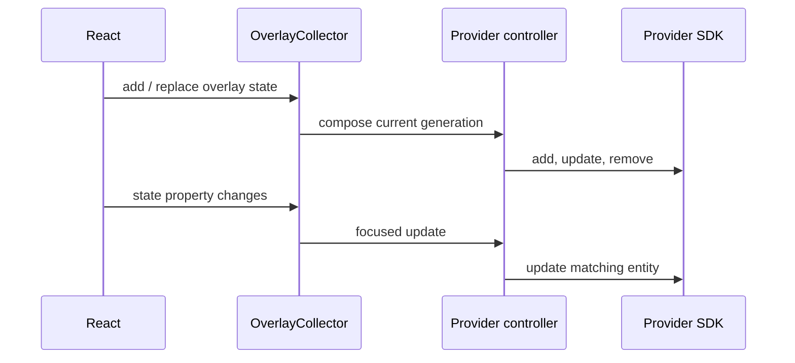

# Architecture

Each provider view owns a `MapViewScope`. Shared overlay components register their states with collectors in that scope. When a composition changes, the provider controller diffs it and updates the real SDK.

## `MapViewScope` and `OverlayCollector`

`MapViewScope` (from `js-sdk-react`) holds one `OverlayCollector<S>` per overlay type — markers, circles, polylines, polygons, ground images, raster layers — plus an `InfoBubbleEntry` collector for bubbles and a `MarkerAnimationStore`. A provider's map view creates one scope, exposes it through React context (`MapViewScopeProvider`), and every `<Marker>`, `<Circle>`, `<Polyline>`... you render underneath calls `useMapViewScope()` to reach the right collector.

`OverlayCollector<S>` is a plain `Map<string, S>` keyed by `state.id`, with two independent notification paths:

- **Composition changes** (`add`, `remove`, `replaceAll`, `applyDiff`, `clear`) notify collection subscribers — the code that diffs the whole set against the provider SDK.
- **Property changes** on an individual state (e.g. `marker.position = next`) go through the state's `asObservable()` fingerprint stream. The collector only subscribes to this per-state stream when `setUpdateHandler()` has been called, and it delivers a focused update for just that entity — not a full re-diff.

`batchChanges(fn)` suppresses both notification paths until `fn` returns, then fires at most one notification. `<Markers>` uses this to turn a full array replacement into a single collector update instead of one per marker (see [Large marker sets](/guides/large-marker-sets/)).

`MapViewScope.buildRegistry()` wraps each collector in a `MapOverlayInterface` (`MarkerOverlay`, `CircleOverlay`, ...) and returns a `MapOverlayRegistry`. Provider controllers consume this registry to attach diff/update logic without depending on React at all — the same collector and overlay classes back the React Native path.

## State ownership

Provider hooks such as `useMapLibreViewState()` create a stable view-state instance. Overlay factory functions such as `createMarkerState()` create mutable observable objects. Construct frequently updated states once with `useState` or `useMemo`; mutate their properties directly rather than replacing the object, so the collector's focused-update path (not a full re-diff) handles the change.

## Readiness

Provider wrappers own map readiness. Overlays can be declared before `onMapLoaded`; pending marker and raster compositions are dispatched after the provider is ready. Avoid page-level readiness gates solely to make overlays appear — that hides lifecycle bugs and makes behavior differ from providers that already queue correctly.

## Attribution

`MapAttributionOverlay` (from `js-sdk-react`) renders a bottom-right attribution strip. It subscribes to the scope's raster-layer collector and combines the current map design's `attributionRules` with each visible raster source's own attribution rules, resolving both against the live camera (so zoom/min-zoom/max-zoom-gated attributions appear only when relevant). Provider views mount this automatically; you generally don't need to render it yourself.

## Platform boundaries

Web provider implementations live in `react-for-*`. React Native bridges live in sibling `reactnative-for-*` packages and wrap the native Android/iOS SDK modules. Shared React Native overlays come from `@mapconductor/js-sdk-react/native`.

Ordinary React Native markers use the batch bridge and native provider controllers directly. The native extension host is reserved for extensions such as heatmap and marker clustering.
