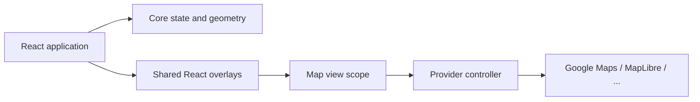

# Introduction

Map SDKs differ in their camera models, overlay objects, event APIs, and lifecycle. MapConductor provides a stable TypeScript model above those differences and connects it to React components.

The SDK has three layers:

1. `@mapconductor/js-sdk-core` contains geometry, camera values, observable overlay state, controllers, and provider-independent utilities.
2. `@mapconductor/js-sdk-react` contains the shared React overlay components and map scope. Use its `/native` entry point on React Native.
3. A provider package creates the real map view and translates common state into a provider SDK.

## Design principles

- Provider-specific code stays at the map-view boundary.
- Overlay state and most UI code can be shared.
- Retain state objects when values change frequently; their properties are observable.
- Use `<Markers states={states} />` for large collections.
- Web providers live in `react-for-*`; native bridges live in separate `reactnative-for-*` packages.

MapConductor does not remove provider setup requirements. API keys, styles, native SDK configuration, terms, and attribution still belong to the selected provider.
