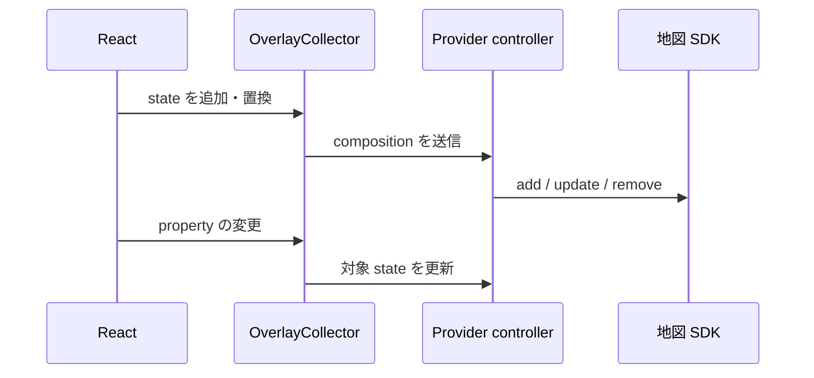

# アーキテクチャ

各 provider view は `MapViewScope` を所有します。共通 overlay component はその scope の collector に state を登録し、provider controller が差分を実際の SDK へ反映します。

provider hook は安定した view state を作ります。overlay state は `useState` や `useMemo` で一度生成してください。overlay は `onMapLoaded` より前に宣言でき、準備完了後に provider wrapper が保留中の composition を送ります。

React Native の通常マーカーは batch bridge と native provider controller を直接通ります。Compose host は heatmap や marker clustering などの native extension 用です。
