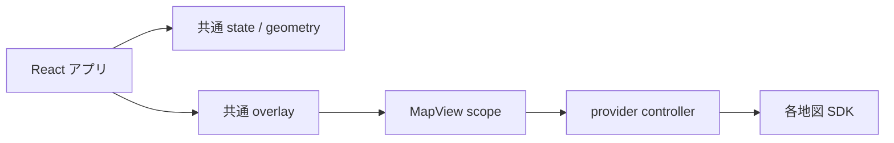

# はじめに

地図 SDK ごとにカメラ、オーバーレイ、イベント、ライフサイクルの API は異なります。MapConductor はそれらの上に安定した TypeScript モデルと React コンポーネントを提供します。

1. `@mapconductor/js-sdk-core`: 座標、カメラ、observable state、controller、共通 utility
2. `@mapconductor/js-sdk-react`: 共通オーバーレイと MapView scope。React Native では `/native` を使用
3. provider package: 実際の地図 view を作り、共通 state を各 SDK へ変換

頻繁に更新する state は保持し、大量のマーカーには `<Markers states={states} />` を使います。Web 実装は `react-for-*`、ネイティブ bridge は別の `reactnative-for-*` パッケージです。

API キー、style、ネイティブ SDK 設定、利用規約、attribution は選択した provider 側の要件に従ってください。
